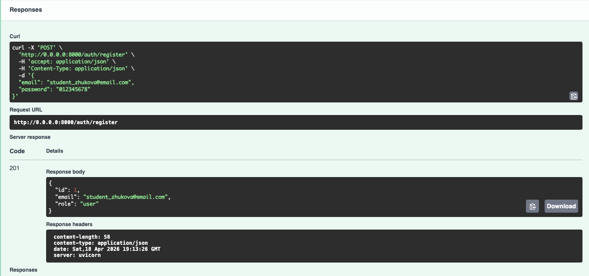
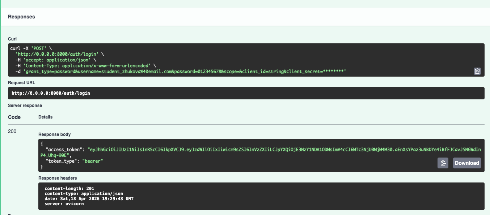
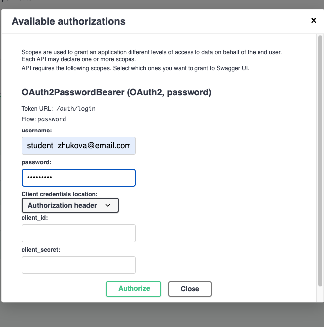
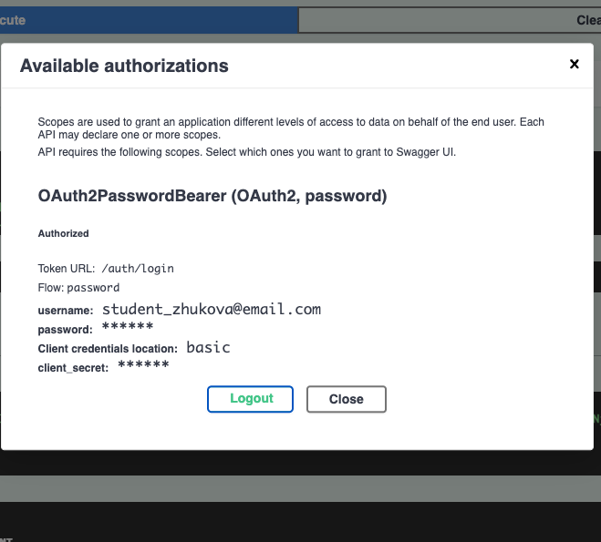
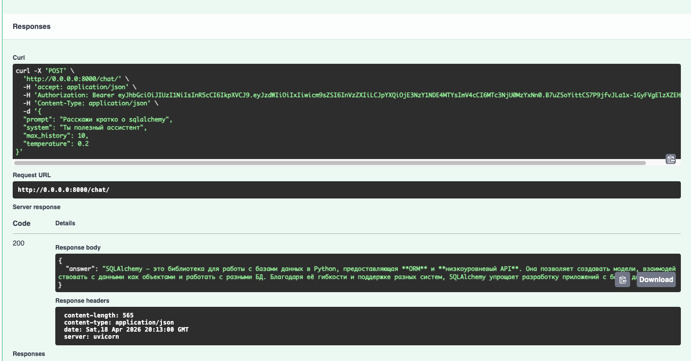
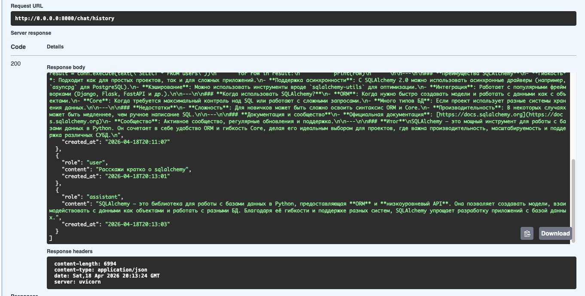
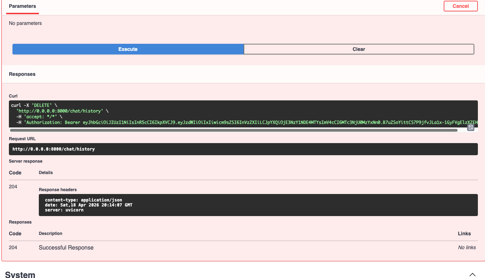
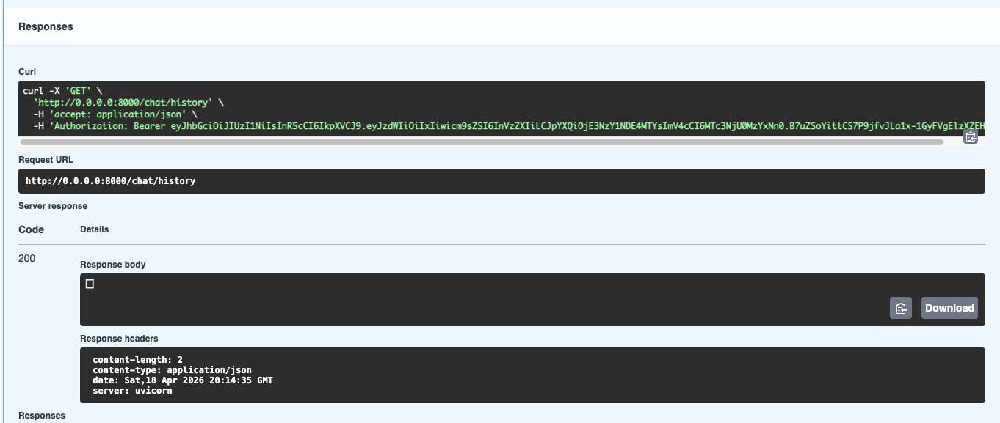

Серверное приложение на FastAPI, предоставляющее защищённый API для взаимодействия с большой языковой моделью (LLM) через сервис OpenRouter.
Реализована аутентификация и авторизация пользователей с использованием JWT, хранение данных в SQLite через SQLAlchemy, разделение ответственности между слоями (API -> бизнес-логика -> доступ к данным).

# Cтруктура катологов

llm_p/
├── pyproject.toml                 # Зависимости проекта (uv)
├── README.md                      # Описание проекта и запуск
├── .env.example                   # Пример переменных окружения
│
├── app/
│   ├── __init__.py
│   ├── main.py                    # Точка входа FastAPI
│   │
│   ├── core/                      # Общие компоненты и инфраструктура
│   │   ├── __init__.py
│   │   ├── config.py              # Конфигурация приложения (env → Settings)
│   │   ├── security.py            # JWT, хеширование паролей
│   │   └── errors.py              # Доменные исключения
│   │
│   ├── db/                        # Слой работы с БД
│   │   ├── __init__.py
│   │   ├── base.py                # DeclarativeBase
│   │   ├── session.py             # Async engine и sessionmaker
│   │   └── models.py              # ORM-модели (User, ChatMessage)
│   │
│   ├── schemas/                   # Pydantic-схемы (вход/выход API)
│   │   ├── __init__.py
│   │   ├── auth.py                # Регистрация, логин, токены
│   │   ├── user.py                # Публичная модель пользователя
│   │   └── chat.py                # Запросы и ответы LLM
│   │
│   ├── repositories/              # Репозитории (ТОЛЬКО SQL/ORM)
│   │   ├── __init__.py
│   │   ├── users.py               # Доступ к таблице users
│   │   └── chat_messages.py       # Доступ к истории чатов
│   │
│   ├── services/                  # Внешние сервисы
│   │   ├── __init__.py
│   │   └── openrouter_client.py   # Клиент OpenRouter / LLM
│   │
│   ├── usecases/                  # Бизнес-логика приложения
│   │   ├── __init__.py
│   │   ├── auth.py                # Регистрация, логин, профиль
│   │   └── chat.py                # Логика общения с LLM
│   │
│   └── api/                       # HTTP-слой (тонкие эндпоинты)
│       ├── __init.py__
│       ├── deps.py                # Dependency Injection
│       ├── routes_auth.py         # /auth/*
│       └── routes_chat.py         # /chat/*
│
└── app.db                         # SQLite база (создаётся при запуске)

# Технологии

* Python 3.11+
* FastAPI – веб-фреймворк
* SQLAlchemy 2.0 (асинхронный) – ORM
* SQLite + aiosqlite – база данных
* Pydantic + Pydantic Settings – валидация и конфигурация
* python-jose – JWT
* passlib + bcrypt – хеширование паролей
* httpx – HTTP клиент для OpenRouter
* uv – менеджер зависимостей

# Управление проектом

## Клонирование репозитория
git clone <url-репозитория>
cd llm_p

## Установка uv (если не установлен)
curl -LsSf https://astral.sh/uv/install.sh | sh
или через pip: pip install uv

## Установка зависимостей
uv sync

## Настройка переменных окружения
Скопируйте пример файла .env:
cp .env.example .env

Отредактируйте .env, указав как минимум:
JWT_SECRET=ваш-секретный-ключ-минимум-32-символа
OPENROUTER_API_KEY=sk-or-v1-...

Опциональные параметры (значения по умолчанию уже заданы):
OPENROUTER_BASE_URL=https://openrouter.ai/api/v1
OPENROUTER_DEFAULT_MODEL=openrouter/free
OPENROUTER_REFERER=http://localhost:8000
OPENROUTER_TITLE=LLM Proxy
SQLITE_PATH=app.db
JWT_ACCESS_TOKEN_EXPIRE_MINUTES=30

## Запуск сервера
uv run uvicorn app.main:app --reload --host 0.0.0.0 --port 8000 
Сервер будет доступен по адресу: http://localhost:8000

## Документация API
Swagger UI: http://0.0.0.0:8000/docs

# Возможности

* Регистрация и аутентификация пользователей (JWT access token).
* Общение с LLM через OpenRouter с сохранением истории диалога.
* Управление историей чата (получение, очистка).
* Автоматическое создание таблиц базы данных при запуске.
* Документация API (Swagger UI) с поддержкой OAuth2.

# API эндпойнты

Все эндпоинты, кроме /auth/register и /auth/login, требуют JWT токен (передаётся в заголовке Authorization: Bearer <token>).

## Аутентификация

POST /auth/register - Регистрация нового пользователя
POST /auth/login - Логин (OAuth2 form) – возвращает access_token
GET /auth/me - Получение профиля текущего пользователя

## Чат

POST /chat/ - Отправить сообщение LLM (с учётом истории)
GET /chat/history - Получить всю историю сообщений пользователя
DELETE /chat/history - Очистить историю сообщений

## Технический

GET /health - Проверка статуса сервера и окружения

# Тестирование через Swagger UI

Запустите сервер и откройте http://localhost:8000/docs

Регистрация: выполните POST /auth/register с JSON {"email": "user@example.com", "password": "12345678"}

Логин: выполните POST /auth/login, в форме укажите username = email, password = пароль. Скопируйте полученный access_token.

Авторизация: нажмите кнопку Authorize (замочек) в правом верхнем углу, введите email и пароль (или вставьте токен вручную), нажмите Authorize.

Отправка сообщения: POST /chat/ с телом 
{
  "prompt": "Расскажи кратко о sqlalchemy",
  "system": "Ты полезный ассистент",
  "max_history": 10,
  "temperature": 0.2
}

Получение истории: GET /chat/history

Удаление истории: DELETE /chat/history

# Скриншоты

## Регистрация

## Логин и получение JWT,

## Аутентификация через Swagger

## Вызов POST /chat

## Получение истории через GET /chat/history

## Удаление истории через DELETE /chat/history

# Примечания

Для работы с OpenRouter необходим API-ключ, который можно получить на https://openrouter.ai/keys.

Для бесплатного использования установите OPENROUTER_DEFAULT_MODEL=openrouter/free.

Обязательно добавьте .env в .gitignore, чтобы не закоммитить секреты.